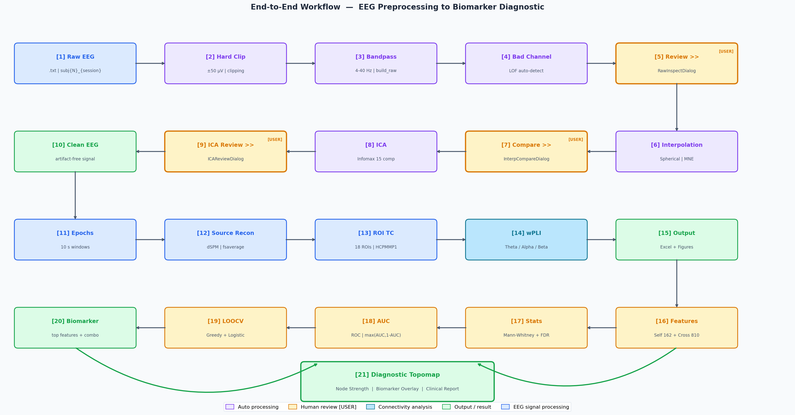
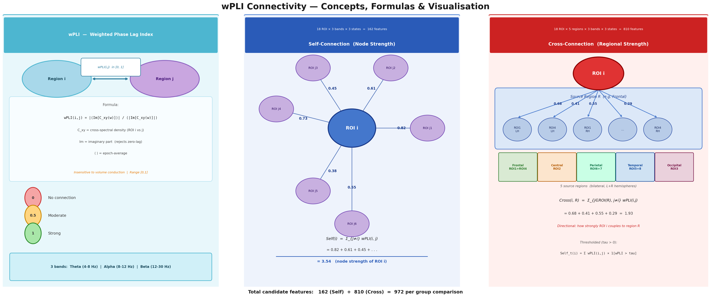
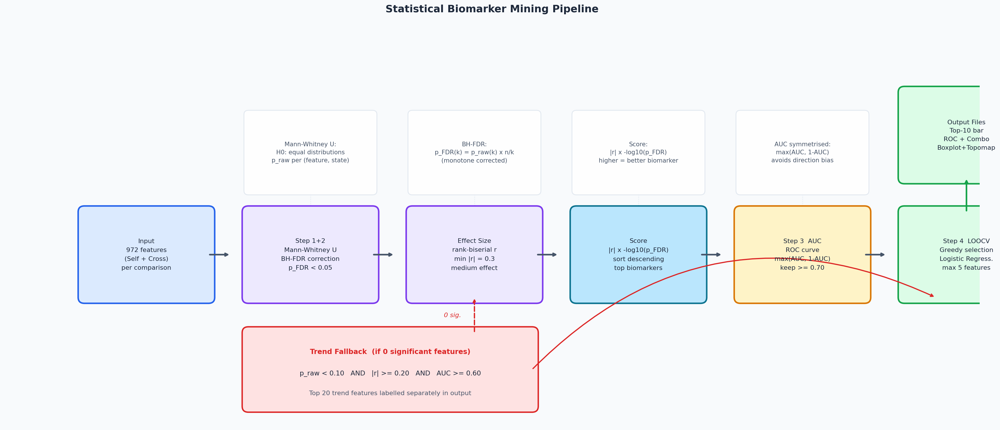
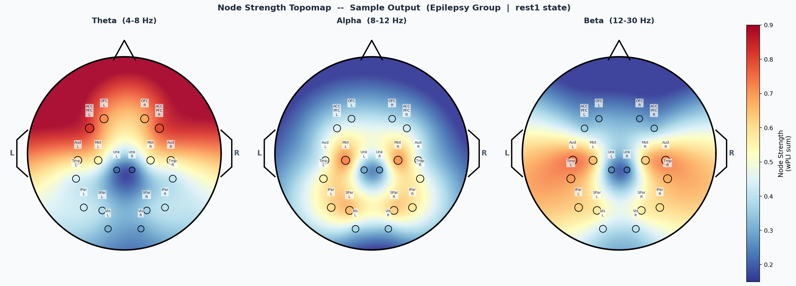

<div align="center">

<h1>🧠 EEG Preprocessing & Connectivity GUI</h1>

<p><strong>v11 &nbsp;·&nbsp; EEG Pipeline &nbsp;·&nbsp; ECG Viewer &nbsp;·&nbsp; Biomarker Analysis</strong></p>

<p><em>A fully integrated, semi-automatic multimodal brain signal analysis system<br>
for clinical EEG research — from raw signal to diagnostic biomarkers</em></p>

[](https://python.org)
[](https://mne.tools)
[](https://pypi.org/project/PyQt5)
[](LICENSE)

</div>

---

## Introduction

Clinical EEG data review is often time-consuming and labor-intensive. To address this challenge, we propose an integrated semi-automatic EEG preprocessing pipeline featuring an interactive GUI for bad channel review, ICA artifact removal, and whole-brain functional connectivity analysis using the **weighted Phase Lag Index (wPLI)**. The system handles signal preprocessing and anomaly detection automatically, while human involvement is reserved solely for final validation.

This **human-in-the-loop** design not only reduces manual effort, but also leverages automated detection to flag subtle artifacts that a human reviewer might otherwise overlook. The downstream **Biomarker Analysis module** extracts statistically validated neural features to assist clinicians in observing brain states and supporting diagnostic decision-making.

---

## System Advantages

| # | Advantage | Description |
|---|---|---|
| 1 | **Automation + Human Oversight** | Auto preprocessing handles the heavy lifting; humans only confirm edge cases |
| 2 | **Catches What Humans Miss** | LOF and spectral IC analysis flag subtle artifacts invisible to naked eye |
| 3 | **Full Audit Trail** | Every decision (auto vs. manual) logged to Excel with complete traceability |
| 4 | **Bidirectional Navigation** | Prev/Next at any stage — revise decisions without restarting |
| 5 | **Re-interpolation Loop** | Unsatisfied with result? Go back and revise bad channels immediately |
| 6 | **ROI Cache** | Source reconstruction cached as `.npy`; skips expensive recomputation |
| 7 | **Multimodal Integration** | ECG module shares the same file format and launcher as EEG pipeline |
| 8 | **Statistical Biomarker Mining** | wPLI features → Mann-Whitney FDR → ROC/AUC → LOOCV Logistic |
| 9 | **Diagnostic Topomap** | Node strength + biomarker overlay on scalp topomap for clinical inspection |
| 10 | **Fully Configurable** | All thresholds in config files — no code changes needed |

---

## Project Structure

```
eeg_connectivity_gui/
├── main.py                          # EEG pipeline entry point
├── main_ecg.py                      # ECG Viewer standalone entry point
├── main_biomarker.py                # Biomarker analysis entry point
├── config.py                        # EEG global constants
├── styles.py                        # Qt color system & StyleSheets
├── requirements.txt
├── roi_coords_18.npy                # 18 ROI MNI coordinates
│
├── docs/                            # Diagrams and reference images
│   ├── topomap_roi_template.svg
│   ├── workflow_e2e.png
│   ├── connection_explainer.png
│   ├── stats_pipeline.png
│   └── topomap_sample.png
│
├── gui/                             # EEG GUI components
│   ├── main_window.py
│   ├── dialogs_raw.py               # Bad channel review & interpolation compare
│   ├── dialogs_ica.py               # ICA component review
│   └── help_content.py
│
├── processing/
│   ├── preprocessor.py              # Clipping / filtering / ICA (no GUI)
│   └── worker.py                    # QThread pipeline coordinator
│
├── analysis/
│   ├── connectivity.py              # wPLI computation & Excel output
│   ├── source_recon.py              # dSPM epochs & ROI time course
│   ├── visualization.py             # Connectivity figure output
│   ├── mne_resources.py             # fsaverage / BEM / ROI label loader
│   └── biomarker/
│       ├── bio_config.py
│       ├── coords.py
│       ├── features.py
│       ├── statistics.py
│       ├── plots.py
│       └── pipeline.py
│
├── ecg/
│   ├── ecg_config.py
│   ├── signal_processing.py
│   ├── worker.py
│   ├── exporter.py
│   └── viewer.py
│
└── utils/
    ├── widgets.py
    └── file_utils.py
```

---

## Quick Start

```bash
git clone https://github.com/your-username/eeg-connectivity-gui.git
cd eeg-connectivity-gui
pip install -r requirements.txt

python main.py             # EEG preprocessing + connectivity
python main_ecg.py         # ECG Heart Rate Viewer
python main_biomarker.py   # Biomarker statistical analysis
```

---

## End-to-End Workflow

The complete 21-step pipeline from raw `.txt` EEG files to clinical diagnostic topomap. **Orange = interactive human review checkpoints; all other steps run automatically.**

<div align="center">

</div>

---

## 18 ROI Head Layout

The system uses the **HCPMMP1_combined** parcellation divided into 18 bilateral ROIs mapped onto the scalp surface.

<div align="center">

</div>

| ROI | Left | Right | Brain Region |
|---|---|---|---|
| ROI1 | ROI1_LH | ROI1_RH | ACC + Medial PFC + IFC + DLPFC |
| ROI2 | ROI2_LH | ROI2_RH | Somatosensory & Motor + Premotor |
| ROI3 | ROI3_LH | ROI3_RH | Visual cortex (V1 + MT+ + Dorsal/Early) |
| ROI4 | ROI4_LH | ROI4_RH | Orbital & Polar Frontal Cortex |
| ROI5 | ROI5_LH | ROI5_RH | Lateral + Medial Temporal |
| ROI6 | ROI6_LH | ROI6_RH | Superior Parietal Cortex |
| ROI7 | ROI7_LH | ROI7_RH | Inferior Parietal + Post. Cingulate + TPO |
| ROI8 | ROI8_LH | ROI8_RH | Auditory Association + Insula |
| ROI9 | ROI9_LH | ROI9_RH | Undefined / subcortical placeholder |

---

## EEG Preprocessing — Step-by-Step Design Rationale

### [1] Raw EEG Loading
**What:** Read `.txt` files matching `subj{N}_{session}.txt`, trim first and last 30 seconds.
**Why:** The first and last 30 s typically contain recording artifacts (electrode settling, end-of-task noise) that would corrupt downstream analysis. Trimming is applied universally to ensure all files start from a stable signal baseline.

### [2] Hard Clipping — ±50 µV
**What:** Clip every sample exceeding ±50 µV to the clipping boundary.
**Why:** Extreme transient artifacts (electrode pops, EMG bursts) can be orders of magnitude larger than EEG signal and would dominate IIR filter transients, distorting entire epochs. Hard clipping before filtering prevents filter ringing propagation into adjacent clean data. The ±50 µV threshold is well above the physiological EEG range (~10–30 µV peak) while catching genuine artifacts.
**Consider:** Lowering to ±30 µV for high-noise recordings; raising to ±75 µV if alpha/beta rhythms are unusually large.

### [3] Bandpass Filter — 4–40 Hz
**What:** Zero-phase FIR bandpass filter (MNE default), then 1–40 Hz for ICA fitting.
**Why:** The 4 Hz lower bound removes slow DC drift and movement-related low-frequency noise that would otherwise inflate node strength estimates. The 40 Hz upper bound attenuates line noise (50/60 Hz) and high-frequency EMG. A separate 1 Hz high-pass is used for ICA fitting to avoid over-suppressing slow-wave components that ICA needs to identify eye blinks (EOG).
**Consider:** Use 0.1 Hz if studying slow oscillations (delta, sleep); keep 40 Hz for typical cognitive EEG.

### [4] Bad Channel Detection — LOF Algorithm
**What:** MNE's Local Outlier Factor (LOF) algorithm identifies channels whose signal statistics deviate significantly from neighbours.
**Why:** LOF is unsupervised and does not require a template, making it robust to inter-individual variation. It detects channels that are locally inconsistent with spatial neighbours — a more physiologically meaningful criterion than simple amplitude thresholds. Choosing LOF over z-score: z-score works well for single outliers but underestimates bad channels when multiple neighbours are also bad (swamping effect); LOF handles clustered bad channels better.
**Consider:** Adjust `n_neighbors` (default 8) for high-density arrays; for 19-channel EEG, 6–8 is appropriate.

### [5] Bad Channel Review — Human Confirmation [USER]
**What:** `RawInspectDialog` shows all channels with time slider; user can add/remove bad channel flags.
**Why:** LOF is powerful but can flag channels with valid but unusual topographies (e.g., Fp1 in a subject with asymmetric skull). Human confirmation eliminates false positives and catches cases where LOF missed subtle flat channels. The review also builds researcher familiarity with data quality across the dataset.
**Logged fields:** Auto-detected / Manually added / Manually removed / Selection mode (auto vs. manual).

### [6] Spherical Interpolation
**What:** MNE spherical spline interpolation reconstructs bad channel signals from surrounding electrodes.
**Why:** Spherical splines are the standard for EEG bad channel reconstruction — they respect the geometry of the electrode sphere and minimise spatial distortion. Interpolation is preferred over simply dropping channels because downstream wPLI requires a consistent 19-channel topology across all subjects.
**Consider:** If > 22% channels are bad (configurable `BAD_CH_LIMIT`), the file is skipped entirely — too many interpolated channels would introduce correlated noise patterns that inflate connectivity estimates.

### [7] Interpolation Compare — Human Confirmation [USER]
**What:** `InterpolationCompareDialog` shows before/after waveforms side-by-side; user can trigger re-interpolation.
**Why:** Interpolation quality depends heavily on the spatial distribution of bad channels. If the flagged channels are isolated, interpolation is excellent; if they cluster (e.g., all right-hemisphere), interpolation quality degrades. Visual confirmation catches these cases before ICA — correcting bad-channel selection at this stage is far cheaper than discovering the problem post-ICA.

### [8] ICA — Extended Infomax, 15 Components
**What:** `mne.preprocessing.ICA` with Extended Infomax algorithm, 15 components.
**Why:** Extended Infomax (Bell & Sejnowski 1995, extended by Lee et al. 1999) handles both sub- and super-Gaussian sources, making it better suited for EEG than the original Infomax which assumes sub-Gaussian. 15 components is appropriate for 19-channel EEG: rule of thumb is `n_components <= (n_channels - n_bad)²/25`. Fewer components risk mixing artifact ICs with neural signal; more components risk overfitting with sparse data.
**Consider:** Reduce to 12 if recordings are short (< 5 min effective data after trimming).

**EOG detection (`Fp1/Fp2`, correlation ≥ 0.5):** Frontal electrodes are most sensitive to eye movement dipoles. Correlation threshold 0.5 balances sensitivity (catches most EOG ICs) against specificity (avoids false-flagging frontal alpha ICs).

**EMG detection (z-score ≥ 0.7):** Muscle artifacts concentrate in high-frequency power (>30 Hz). The z-score approach is relative to the session's own noise floor, making it robust across subjects with different muscle tone levels.

**Auto-exclusion cap (MAX_AUTO_EXCL = 5):** Capping at 5 prevents over-cleaning — removing too many ICs risks eliminating genuine neural signal with similar topographies. EOG ICs get priority because ocular artifacts are the most damaging for frontal connectivity estimates.

### [9] ICA Review — Human Confirmation [USER]
**What:** `ICAReviewDialog` shows IC topography, 10-second time series, and power spectrum for each component. Users can toggle exclusions.
**Why:** Automatic EOG/EMG detection is reliable for clear artifacts but can misclassify ICs in unusual montages or when multiple artifact types co-occur. The three-panel view (topomap + timeseries + spectrum) gives complementary information: topomap identifies spatial origin, timeseries reveals temporal pattern (blinks vs. drift), spectrum distinguishes EMG from alpha (8–13 Hz peak vs. flat spectrum).
**Logged fields:** Auto-excluded ICs / Manually added exclusions / Manually restored ICs / Selection mode.

### [10] Clean EEG Output
The interpolated, ICA-cleaned signal is ready for source reconstruction. At this point, only neural signal remains — artifacts from electrodes, eye movements, and muscle have been removed with full traceability.

### [11] Epoch Building — 10 s Fixed Windows
**What:** Continuous clean EEG is cut into non-overlapping 10-second epochs.
**Why:** 10 seconds provides sufficient frequency resolution for theta (0.1 Hz resolution) while keeping each epoch short enough to treat as quasi-stationary. Non-overlapping epochs avoid introducing autocorrelation between epochs that would bias connectivity estimates. Epochs with remaining artifacts are automatically dropped by MNE's `drop_bad()`.
**Consider:** Shorter epochs (5 s) if studying rapid state changes; longer (20 s) if studying very slow delta oscillations.

### [12] Source Reconstruction — dSPM on fsaverage
**What:** dSPM (dynamical Statistical Parametric Mapping) inverse solution using BEM forward model on the fsaverage template brain.
**Why:** dSPM provides noise-normalised source estimates (similar to SNR maps) and is more robust than simple MNE minimum norm when electrode count is low (19 channels). Using fsaverage avoids the need for individual MRI scans — critical for clinical research where MRI may not be available. The `oct4` source space offers sufficient spatial resolution for 18 ROI-level analysis without excessive computation.
**Consider:** Source reconstruction is the most computationally expensive step. Results are cached in `{subj}_roi_tc_cache/` — delete the cache folder to force recomputation if parameters change.

### [13] ROI Time Course Extraction — HCPMMP1, 18 ROIs
**What:** Extract mean source amplitude time course within each of 18 bilateral cortical ROIs from the HCPMMP1 parcellation.
**Why:** Averaging within anatomically defined parcels reduces the dimensionality from ~5,000 source points to 18 ROI signals, making connectivity estimation tractable and interpretable. The HCPMMP1 atlas is based on multi-modal MRI data (Glasser et al. 2016) and provides the most detailed cortically-constrained parcellation available on fsaverage. The 9 bilateral pairs cover all major functional networks relevant to epilepsy research.

### [14] wPLI Connectivity — Theta / Alpha / Beta
**What:** `mne_connectivity.spectral_connectivity_epochs` with `method='wpli'`, computed for theta (4–8 Hz), alpha (8–12 Hz), and beta (12–30 Hz) bands.
**Why — why wPLI over coherence?** Coherence is inflated by volume conduction (signals smearing across electrodes due to tissue conductivity). wPLI uses only the imaginary component of the cross-spectrum, which is zero for perfectly phase-synchronous (zero-lag) signals — precisely the signature of volume conduction. This makes wPLI a more specific measure of genuine neural synchrony rather than spatial smearing artifacts.
**Why multitaper?** Multitaper spectral estimation reduces variance in the frequency domain compared to FFT, particularly important for short epochs.

---

## wPLI Connectivity — Concepts, Formulas & Visualisation

<div align="center">

</div>

### wPLI Formula

```
wPLI(i,j) = |<Im[C_xy(w)]>|  /  <|Im[C_xy(w)]|>

  C_xy  = cross-spectral density between ROI i and ROI j
  Im    = imaginary part  (zero for volume-conducted signals)
  <.>   = epoch-average
  Range = [0, 1]
```

### Self-Connection — Node Strength

```
Self(i) = sum_{j != i}  wPLI(i, j)          (raw, all connections)
Self_t(i) = sum wPLI(i,j) * 1[wPLI > tau]   (thresholded version)

Features:  18 ROI x 3 bands x 3 states  =  162
```

### Cross-Connection — Regional Directed Strength

```
Cross(i, R) = sum_{j in ROI(R), j != i}  wPLI(i, j)

5 source regions (bilateral):
  Frontal   = ROI1 + ROI4    Central   = ROI2
  Parietal  = ROI6 + ROI7    Temporal  = ROI5 + ROI8
  Occipital = ROI3

Features:  18 ROI x 5 regions x 3 bands x 3 states  =  810
Total candidate features per comparison:  972
```

### Frequency Band Clinical Relevance

| Band | Range | Why it matters |
|---|---|---|
| **Theta** | 4–8 Hz | Hippocampal–cortical memory encoding; elevated in epilepsy during ictal spread |
| **Alpha** | 8–12 Hz | Cortical inhibition; reduced connectivity suggests disinhibition |
| **Beta** | 12–30 Hz | Active cognitive control; interictal changes linked to AED effects |

---

## Biomarker Analysis — Statistical Pipeline

<div align="center">

</div>

### Step-by-Step Design Rationale

**Step 1+2 — Mann-Whitney U + Benjamini-Hochberg FDR**
**Why non-parametric?** wPLI values are bounded [0,1] and may not follow a normal distribution, especially in small clinical samples. Mann-Whitney U makes no distributional assumptions, providing valid inference regardless of skewness.
**Why FDR over Bonferroni?** With 972 tests, Bonferroni (alpha/n) would require p < 0.0001, eliminating most biologically meaningful signals. Benjamini-Hochberg FDR controls the expected proportion of false discoveries at 5%, offering far more statistical power while maintaining acceptable error control for exploratory biomarker research.

```
p_FDR(k) = min(1,  p_raw(k) x n / k)   [rank k ascending, n = total tests]
Threshold: p_FDR < 0.05  AND  |r| >= 0.3
```

**Effect Size — Rank-Biserial r**
**Why not Cohen's d?** Cohen's d assumes equal variance and normality. Rank-biserial r is distribution-free and maps directly from the Mann-Whitney U statistic, making it theoretically consistent with the test.

```
r = 1 - (2 x U) / (n1 x n2)   [range -1 to +1]
|r| >= 0.3 = medium effect (threshold); >= 0.5 = large effect
```

**Biomarker Score**
**Why this formula?** Multiplying |r| by `-log10(p_FDR)` creates a composite that rewards both large effect size AND high statistical confidence. A feature with |r|=0.6 but p=0.04 scores lower than one with |r|=0.7 and p=0.001, correctly prioritising the more reliable biomarker.

```
score = |r|  x  (-log10(p_FDR))
```

**Trend Fallback (automatic, if 0 FDR-significant features)**
**Why?** In small clinical samples (N < 30 per group), even genuine effects may not survive FDR correction. Rather than reporting zero findings, the fallback uses relaxed thresholds to surface promising candidates clearly labelled as "trend" — not false positives, but signals warranting replication in larger samples.

```
p_raw < 0.10  AND  |r| >= 0.20  AND  AUC >= 0.60
```

**Step 3 — ROC / AUC**
**Why symmetrised?** `max(AUC, 1-AUC)` handles the direction of the feature — if group2 has lower values than group1, the raw AUC < 0.5. Symmetrising ensures AUC reflects discriminability regardless of direction, consistent with the rank-biserial r direction flag.
**Threshold AUC >= 0.70:** Features below 0.70 offer less practical diagnostic value than a clinical decision rule based on a single biomarker.

**Step 4 — Greedy Forward Selection + LOOCV**
**Why greedy over exhaustive search?** With up to 972 candidates, exhaustive search of all k-feature combinations is computationally infeasible. Greedy forward selection finds a locally optimal solution efficiently.
**Why LOOCV?** With small N (10–30 subjects per group), k-fold CV has high variance. LOO uses N-1 training samples per fold, maximising training set size and giving the most conservative (honest) estimate of generalisation performance.
**Why Logistic Regression?** Interpretable coefficients, no hyperparameter tuning required, well-calibrated probabilities for AUC computation. Ridge regularisation (L2, C=1.0) prevents overfitting in small samples.
**Stop criterion (gain < 0.005):** Adding a feature that improves LOOCV AUC by less than 0.5% is unlikely to generalise — the small gain is probably noise.

---

## Sample Topomap Output

Node Strength topomap showing wPLI connectivity distribution across the scalp. **Red = high node strength (dense connectivity); blue = low.** Circle size scales with node strength. This visualisation directly supports clinical observation — for example, elevated frontal Theta in epilepsy reflects network hypersynchrony.

<div align="center">

</div>

**Clinical interpretation guide:**
- Theta frontal hyperconnectivity → hallmark of mesial temporal lobe epilepsy network propagation
- Alpha posterior hypoconnectivity → visual cortex inhibitory disruption
- Beta temporal hyperconnectivity → possible AED-related modulation of motor/language networks
- Asymmetric L/R patterns → lateralising value for pre-surgical evaluation

---

## System Architecture

```
┌─ Input ────────────────────────────────────────────────────────────────────┐
│  EEG .txt files            Drug info Excel         roi_coords_18.npy       │
│  subj{N}_{session}         編號 / 用藥數量           MNI coordinates         │
└────────────────────────────────────────────────────────────────────────────┘
         │                            │                        │
         ▼                            ▼                        ▼
┌─ EEG Pipeline (main.py) ──────────────────────────────────────────────────┐
│  MainWindow                                                                │
│  ├── Left sidebar: Browse / Parameters / ECG / Load MNE / Run / Stop      │
│  └── Right tabs:  Files | Processing Log | Help                            │
│                                                                            │
│  ProcessWorker (QThread) ─────────────────────────────────────────────────┤
│  preprocessor.py:  clip → 4-40Hz → LOF bad channel → interpolation → ICA  │
│  source_recon.py:  10s epochs → dSPM → 18 ROI time courses                │
│  connectivity.py:  wPLI Theta/Alpha/Beta → 18x18 matrices → Excel + figs  │
│                                                                            │
│  Review Dialogs (main thread, blocking worker via threading.Event)         │
│  ├── RawInspectDialog         waveform + time slider + channel checkboxes  │
│  ├── InterpolationCompareDialog  before/after + re-interpolate option      │
│  └── ICAReviewDialog          IC topo + timeseries + spectrum; toggle      │
└────────────────────────────────────────────────────────────────────────────┘
         │ wPLI Excel (18x18 x 3 bands x N subjects)
         ▼
┌─ Biomarker Module (main_biomarker.py) ────────────────────────────────────┐
│  pipeline.py                                                               │
│  ├── features.py     Self(162) + Cross(810) = 972 features per subject     │
│  ├── statistics.py   Mann-Whitney → BH-FDR → rank-biserial r → AUC → LOOCV│
│  └── plots.py        topomap + ROC curves + boxplots + bar chart + report  │
└────────────────────────────────────────────────────────────────────────────┘
         │
         ▼
┌─ ECG Module (main_ecg.py) ────────────────────────────────────────────────┐
│  ECGViewer: A1/A2 channel → quality score → R-peak → HR / HRV → status    │
│  export_excel: Heart Rate Results + Summary sheet                          │
└────────────────────────────────────────────────────────────────────────────┘
```

---

## Output Files

```
{data_folder}/
│
├── {subj}_con_figures_10s/                  Connectivity outputs
│   ├── {stem}/
│   │   ├── heatmap_3band.png                ROI connectivity heatmap (3 bands)
│   │   ├── circle_Theta_4_8_Hz.png          Circle connectivity — Theta
│   │   ├── circle_Alpha_8_12_Hz.png         Circle connectivity — Alpha
│   │   ├── circle_Beta_12_30_Hz.png         Circle connectivity — Beta
│   │   ├── connectome_theta.png             3D nilearn connectome
│   │   ├── connectome_alpha.png
│   │   ├── connectome_beta.png
│   │   ├── view_connectome_theta.png        2D top-view network graph
│   │   ├── view_connectome_alpha.png
│   │   └── view_connectome_beta.png
│   ├── mean_connectivity_wpli.txt           Per-file mean wPLI per band
│   ├── all_bad_channel_stats.xlsx           Bad channel summary — all files
│   └── all_ica_exclusion_stats.xlsx         ICA exclusion summary — all files
│
├── {subj}_matrix_10s/
│   └── {subj}_10s_{stem}.xlsx              3-sheet matrices (Theta/Alpha/Beta)
│
├── {subj}_interp_records/{stem}/
│   ├── interp_compare.png                   Before / after waveform comparison
│   └── interp_log.xlsx                      Channels: auto / added / removed / mode
│
├── {subj}_ica_records/{stem}/
│   ├── ICA_check/ICA_before_after.png       3-column waveform comparison
│   ├── ICA_check/ICA_components_topo.png    IC topography grid (top 8)
│   └── ica_log.xlsx                         ICs: auto / added / restored / mode
│
├── {subj}_roi_tc_cache/
│   └── {stem}_roi_tc.npy                   Cached ROI time courses
│
├── biomarker_output/
│   ├── raw_features.csv                     All 972 features × all subjects
│   ├── all_features_C1.xlsx                 Full stats: Normal vs Epilepsy
│   ├── all_features_C2.xlsx                 Full stats: Normal vs Low-dose
│   ├── all_features_C3.xlsx                 Full stats: Low-dose vs High-dose
│   ├── significant_C{1-3}.xlsx             FDR-significant features
│   ├── trend_features_C{1-3}.xlsx          Trend fallback (if 0 significant)
│   ├── top_biomarkers_C{1-3}.xlsx          AUC-filtered top features
│   ├── best_combo_C{1-3}.xlsx             Greedy LOOCV best combination
│   ├── summary_report.txt                  Human-readable text summary
│   └── plots/
│       ├── node_strength_{group}_{state}.png   Node strength topomap (3 bands)
│       ├── top10_C{1-3}.png                    Top-10 biomarker bar chart
│       ├── roc_C{1-3}.png                      ROC curves — top 5 features
│       ├── roc_combo_C{1-3}.png               Best combo LOOCV ROC
│       ├── boxplot_C{1-3}.png                  Group distribution boxplots
│       └── topomap_C{1-3}_{band}_{state}.png   Biomarker head topomap
│
└── ECG_HeartRate_Results.xlsx
    ├── Heart Rate Results                   HR / HRV RMSSD / Status per subject
    └── Summary                              Count + Mean±SD + Thresholds used
```

### Excel Log Column Details

**`interp_log.xlsx`**
```
Filename | Interpolated channels | Channel count | Ratio% |
Auto detected | Manually added | Manually removed | Selection mode | Status
```

**`ica_log.xlsx`**
```
Filename | IC count excluded | EOG ICs | EMG ICs | Manual ICs |
Manually added exclusions | Manually restored ICs | Selection mode | IC indices
```

**`top_biomarkers_C{n}.xlsx`**
```
feat_id | feat_type | roi | band | region | state |
n_group1 | n_group2 | median_group1 | median_group2 | direction |
p_raw | p_fdr | r | stars | score | auc
```

---

## ECG Heart Rate & HRV Classification

| Status | Condition | Interpretation |
|---|---|---|
| **Calm** | 60 <= HR <= 100 AND RMSSD >= 20 ms | Normal resting autonomic balance |
| **Stressed** | HR > 100 OR RMSSD < 20 ms | Sympathetic dominance / reduced HRV |
| **Bradycardia** | HR < 60 BPM | Parasympathetic dominance or AED effect |
| **Poor Quality** | Artifact > 30% / both channels poor | Signal insufficient for reliable analysis |

**HRV (RMSSD)** = Root Mean Square of Successive RR Differences — higher = better parasympathetic tone / more HRV. Values < 20 ms suggest autonomic dysfunction, common in epilepsy.

---

## Configuration Reference

**EEG — `config.py`**
```python
CLIP_TRUN     = 5e-5    # Hard clipping ±50 µV (lower for noisier recordings)
N_ICA_COMP    = 15      # ICA components (reduce if data < 5 min effective)
EOG_THRESHOLD = 0.5     # Fp1/Fp2 correlation; lower = stricter EOG rejection
EMG_THRESHOLD = 0.7     # EMG z-score; lower = stricter muscle rejection
EPOCH_LENGTH  = 10      # Seconds per epoch (increase for slow oscillations)
BAD_CH_LIMIT  = 22      # Skip file if bad channel % exceeds this
RANDOM_SEED   = 42      # Global seed for reproducibility
```

**Biomarker — `analysis/biomarker/bio_config.py`**
```python
THRESHOLD   = 0.0    # 0.0 = raw node strength; >0 = thresholded (sparser)
ALPHA_FDR   = 0.05   # FDR level (0.1 for exploratory; 0.01 for confirmatory)
EFFECT_MIN  = 0.3    # Min |r| — medium effect; raise to 0.5 for large-only
AUC_MIN     = 0.70   # Min AUC — practical discriminability threshold
MAX_COMBO   = 5      # Max LOOCV feature combination size
TREND_P_RAW = 0.10   # Trend fallback raw p (increase for more candidates)
TREND_AUC   = 0.60   # Trend fallback AUC (lower than main threshold)
```

**ECG — `ecg/ecg_config.py`**
```python
HR_HIGH              = 100   # Stressed threshold BPM (adjust per population)
HR_LOW               = 60    # Bradycardia threshold BPM
HRV_LOW              = 20    # Low RMSSD threshold ms (epilepsy often < 20)
DEFAULT_ART_Z        = 4.0   # Artifact z-score (lower = more aggressive removal)
POOR_SCORE_THRESHOLD = 55    # Channel quality score (0-100, lower = better)
```

---

## Notes & Caveats

- **Data trimming**: 30 s trimmed from both ends. Ensure recordings > 60 s net duration.
- **Filename format**: Only `subj{N}_{session}.txt` loaded. Modify `FILE_PATTERN` in `config.py`.
- **ROI cache**: Delete `{subj}_roi_tc_cache/` to recompute after changing epoch length or filter settings.
- **Bad channel threshold**: >22% bad channels triggers automatic skip to prevent over-interpolated data from corrupting group-level connectivity patterns.
- **MNI coordinates**: `roi_coords_18.npy` must be in project root for accurate topomap. Fallback estimates are used if missing (slightly less accurate projection).
- **Biomarker groups**: `subj01–25` = Epilepsy (split by drug count >= 3); `subj26+` = Normal.
- **MNE resources**: First run downloads fsaverage (~1.5 GB). Cached at MNE data path afterwards.
- **Volume conduction**: wPLI's imaginary-component approach substantially reduces but does not completely eliminate volume conduction effects at the source level.

---

## License

MIT License — see `LICENSE` for details.

---

## Acknowledgements

- [MNE-Python](https://mne.tools/) — EEG/MEG analysis framework
- [MNE-Connectivity](https://mne.tools/mne-connectivity/) — Functional connectivity
- [Nilearn](https://nilearn.github.io/) — Neuroimaging visualization
- [PyQt5](https://pypi.org/project/PyQt5/) — GUI framework
- [scikit-learn](https://scikit-learn.org/) — Machine learning
